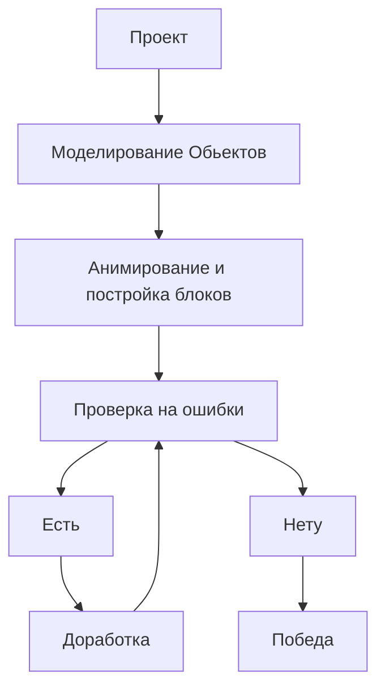

```mermaid
graph TD
    A[Проект] --> B[Моделирование Обьектов];
    B --> C[Анимирование и постройка блоков];
    C --> D[Проверка на ошибки];
    D --> Есть --> F[Доработка];
    F ---> D;
    D --> Нету --> G[Победа];
```
